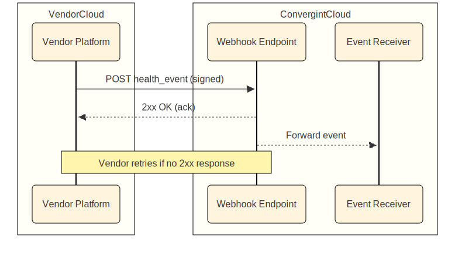

## On-Prem to Cloud: Vendor-Managed Integrations

## Context

Convergint is evolving how we integrate with physical security platforms.

Historically, many integrations to on-prem systems have relied on **on-prem agents/connectors** that Convergint develops, distributes, and maintains. This works, but it pushes ongoing complexity onto Convergint (SDK/version drift, customer network constraints, credential handling, upgrades, and site-specific edge cases).

This document describes the next evolution: vendors own and operate the on-prem integration surface (if any) and Convergint integrates **cloud-to-cloud**. We "meet in the cloud."

This is a **high-level** document intended to align on the integration contract (inventory + events). We expect to collaborate on the design specifics with each vendor.

**What changes**

- **Responsibility shift**: vendor manages the connector lifecycle and on-prem complexity behind the scenes.
- **Integration surface**: Convergint consumes inventory via vendor cloud APIs and receives live events via vendor webhooks.
- **Outcome**: faster onboarding, fewer on-prem dependencies, and a clearer shared contract for inventory + events.

**Why vendors are best positioned**

- Vendors have first-party knowledge of their platform and control over internal interfaces, schemas, and release cycles.
- Vendors can often provide a more reliable cloud pipeline (APIs + webhooks) than third parties constrained to public/on-prem SDK surfaces.

## What We Need From Vendors

- **Inventory API**: provide a cloud API that returns device inventory (including latest known status) for a given org/site.
- **Events Webhook**: publish at least device health events (online/offline/last_seen) to a Convergint webhook endpoint. More event families are strongly preferred.
- **Org/Site model**: expose stable org/account and site/location identifiers, plus basic site metadata (name + address/coords + timezone).

## Today's World (On-Prem Agents Owned by Convergint)

Convergint-owned agent runs at the customer site and forwards inventory/events to Convergint Cloud.

## Target World (Vendor-Managed Cloud Model)

Vendor-owned connector (if any) runs at the customer site; Convergint integrates directly with the vendor cloud via APIs + webhooks.

## Scope

We're looking for two core capabilities from a vendor's cloud platform:

1. **Asset Inventory**
   - Pull a full list of devices/assets for a given Convergint customer/site.
   - At minimum, inventory must reflect each device’s **latest known status**.
2. **Live Events (Push Preferred)**
   - **Baseline**: device health events (online/offline/last_seen) delivered via webhooks.
   - **Preferred**: additional event families the vendor already exposes through on-prem SDKs (alarms/trouble, access events, video/VMS events, etc.).

Every payload (inventory or event) must include enough metadata to reliably map vendor entities to the correct Convergint customer and site.

## Integration Model

### Mapping / Binding (Tenant + Site)

We prefer **credential-bound integrations**:

- Convergint stores vendor-issued credentials (API keys, OAuth tokens, etc.) and binds them to a specific Convergint customer and one or more sites.
- Vendors send webhooks to a Convergint endpoint secured by a vendor-provided signing secret.
- The webhook payload must include the vendor’s `org_id` and `site_id` (or equivalent), and Convergint resolves those to our internal customer/site mapping.

This is consistent with how many modern cloud integrations behave today, where vendor "Account/Org" and "Location/Site" identifiers exist and can be used for resolution.

## Minimum Data Requirements

At a minimum, we need the following fields.

### Account / Site Metadata (at least once per site)

- **Vendor org/account ID**
- **Vendor site/location ID**
- **Site name**
- **Site address** (or coordinates) and **timezone** (preferred; at minimum, one stable site descriptor)

### Inventory (per device)

- Unique device ID
- Device name or label
- **Device type** (camera, door, panel, etc.)
- **Vendor org/account ID** (or a stable equivalent)
- **Vendor site/location ID** (or a stable equivalent)
- Online/offline status (optional if fully covered by events, but recommended)
- MAC address (if available)

**Nice to Have**

- IP
- Hostname
- Site name
- Site address and/or coordinates
- Timezone
- Last seen timestamp (if not covered in events)
- Vendor model / firmware version

### Health Events (baseline)

- Unique device ID
- **Status** (`online` / `offline` or equivalent)
- Timestamp
- **Vendor org/account ID**
- **Vendor site/location ID**
- Stable event identifier (preferred) to support idempotency/deduplication

### Additional Events (preferred)

The vendor should expose an event catalog. Convergint prefers webhooks for all event families the platform can publish, but will start with health.

Examples of event families we may adopt (depending on vendor support):

- Alarm/trouble conditions
- Access-control activity (granted/denied, door forced/held, etc.)
- Video/VMS health (recording failure, stream loss, storage issues)

## Target Workflows

### 1. Inventory Sync (Poll)

- Convergint calls vendor cloud APIs to fetch inventory.
- Convergint receives a complete inventory payload from the vendor cloud.

### 2. Real-Time Events (Push via Webhooks)

- Vendor cloud publishes events to a Convergint webhook endpoint.
- Convergint verifies the signature and processes the event.
- Device status (and related metadata) is updated; events can be recorded for downstream use.

### Fallback Behavior (Empty / Delayed / Offline)

We expect real-world gaps. A vendor integration should support:

- **Empty/bootstrapping state**: initial inventory sync can run before any webhooks have been received.
- **Webhook delays**: timestamps and idempotency keys (or stable event IDs) to dedupe/replay safely.
- **Temporary webhook outage**: Convergint can fall back to periodic polling to reconcile device status.
- **Partial coverage**: if certain device classes cannot publish events, inventory must include their latest status.

## Integration Lifecycle

1. **Onboarding**
   - Configure credentials (API key / OAuth app).
   - Bind vendor org + site(s) to Convergint customer/site records.
   - Configure webhook destination + signing secret.
2. **Collection**
   - Poll inventory on a schedule.
   - Receive events continuously via webhooks.
3. **Data Mapping**
   - Convergint maps vendor device taxonomy and statuses into a consistent Convergint schema.
4. **Operational Expectations**
   - Signed webhooks with replay protection (timestamp window recommended).
   - Retry semantics and idempotency to prevent duplicates.

## Next Steps (Collaborative)

We recognize this model may be net-new work for vendors that historically integrate primarily via on-prem SDKs.

If you’re open to pursuing this, we’d like to collaborate on the design and implementation details together.

**What we can provide**

- A sample schema for inventory + baseline health events
- A test webhook endpoint and guidance for signing/replay protection
- Working sessions to align on your org/site model and event catalog

**What we’d like from you**

- Your proposed **Inventory API** approach (endpoints, scoping by org/site, pagination, rate limits)
- Your proposed **Webhook** approach for health events (signing, retries) and a roadmap for additional event families
- The identifiers and site metadata you can expose (org IDs, site IDs, site name/address/timezone)

*For questions or next steps, contact:*

**Ryan Johnston** – [ryan.johnston@convergint.com](mailto:ryan.johnston@convergint.com) Director Engineering

**Juan Pemberthy** – [juan.pemberthy@convergint.com](mailto:juan.pemberthy@convergint.com) Principal Software Engineer
