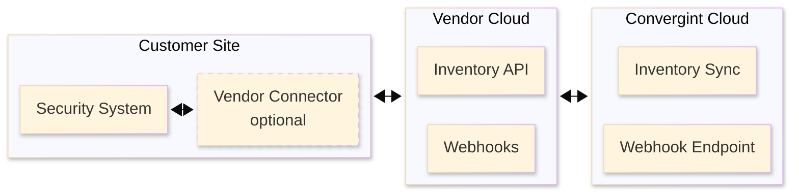

# Chart 2: Target World (Vendor-Managed Cloud Model)

```mermaid
---
config:
  theme: base
  layout: elk
  look: neo
---
flowchart LR
 subgraph customerSite["Customer Site"]
        securitySystem["Security System"]
        vendorConnector["Vendor Connector<br>optional"]
  end
 subgraph vendorCloud["Vendor Cloud"]
        vendorInventoryApi["Inventory API"]
        vendorWebhooks["Webhooks"]
  end
 subgraph convergintCloud["Convergint Cloud"]
        convergintInventorySync["Inventory Sync"]
        convergintWebhookEndpoint["Webhook Endpoint"]
  end
    securitySystem <--> vendorConnector
    customerSite <--> vendorCloud
    vendorCloud L_vendorCloud_convergintCloud_0@<--> convergintCloud

     vendorConnector:::optional
    classDef optional stroke-dasharray:5 5

    L_vendorCloud_convergintCloud_0@{ curve: linear }
```
