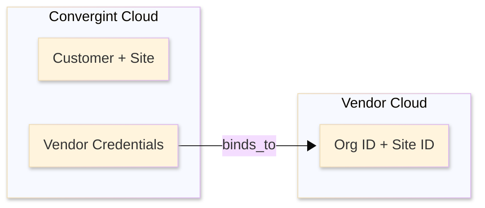

# Chart 3: Mapping / Binding (Tenant + Site)

```mermaid
---
config:
  theme: base
  layout: dagre
  look: neo
---
flowchart LR
  subgraph convergintCloud [Convergint Cloud]
    customerSite[Customer + Site]
    vendorCreds[Vendor Credentials]
  end

  subgraph vendorCloud [Vendor Cloud]
    vendorOrgSite[Org ID + Site ID]
  end

  vendorCreds -->|binds_to| vendorOrgSite
```
