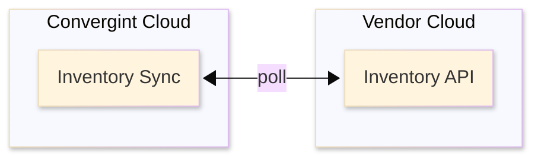

# Chart 4: Inventory Sync (Poll)

```mermaid
---
config:
  theme: base
  layout: dagre
  look: neo
---
flowchart LR
  subgraph vendorCloud [Vendor Cloud]
    vendorInventoryApi[Inventory API]
  end

  subgraph convergintCloud [Convergint Cloud]
    inventorySync[Inventory Sync]
  end

  inventorySync <--> |poll| vendorInventoryApi
```
