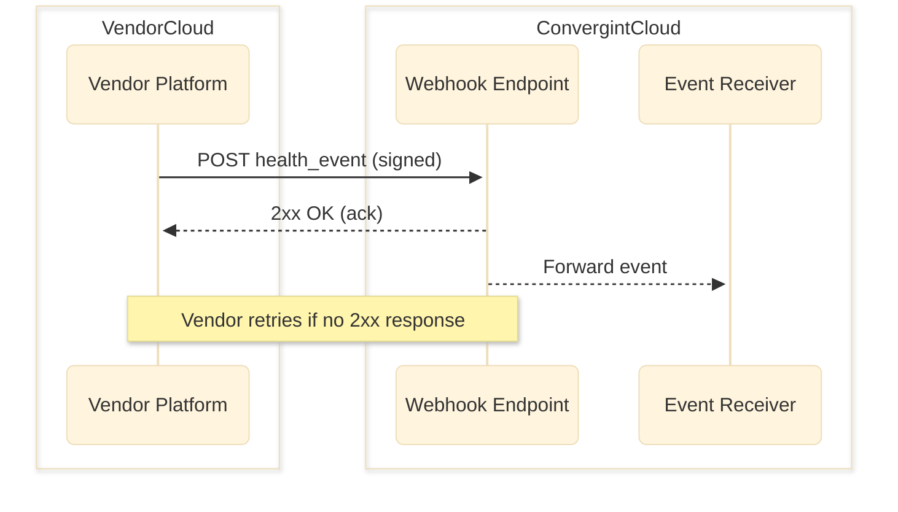

# Chart 5: Real-Time Events (Push via Webhooks)

```mermaid
---
config:
  theme: base
  look: neo
---
sequenceDiagram
  box VendorCloud
    participant VendorPlatform as Vendor Platform
  end
  box ConvergintCloud
    participant WebhookEndpoint as Webhook Endpoint
    participant EventReceiver as Event Receiver
  end

  VendorPlatform->>WebhookEndpoint: POST health_event (signed)
  WebhookEndpoint-->>VendorPlatform: 2xx OK (ack)
  WebhookEndpoint-->>EventReceiver: Forward event

  Note over VendorPlatform,WebhookEndpoint: Vendor retries if no 2xx response
```
